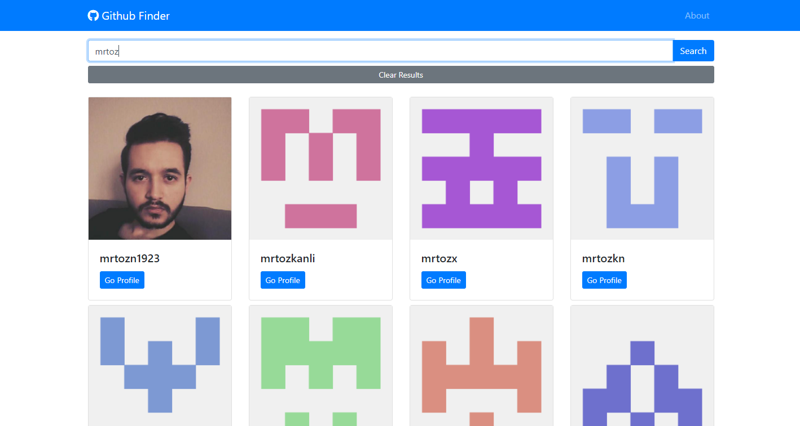
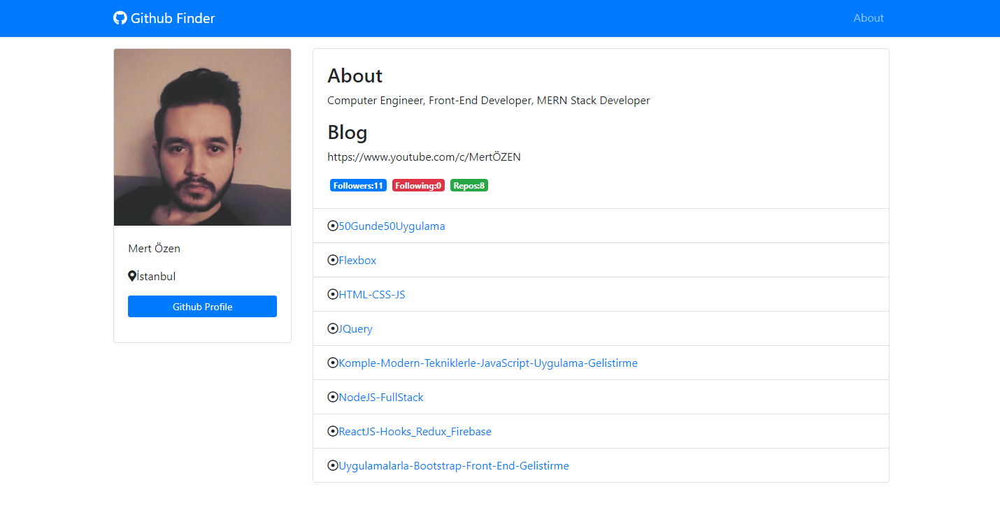

# ReactJS-Hooks, Redux, Firebase

Bu repository üzerinde ReactJS ile yapmış olduğum çalışmalarıma ait dosyalara yer veriyorum.

## Bölüm Başlıkları

- React Basics
- React Components
- Webpack
- Styling React
- Project:Github Finder
- React Router
- React Hooks & Context
- Github Finder:Context & Publish
- Project:BlogApp
- Redux
- React Redux
- Firebase
- BlogApp:Firebase
- Firebase Authentication

## Github Finder (Hosting:Netlify)
Github API kullanarak kullanıcı profillerini kullanıcı adına göre arayan ve repo bilgilerini listeleyen react uygulamama netlify üzerinden erişebilirsiniz. 

NOT: Özel bir token ile erişim yapılmadığı için Github API isteklerde sınırlama getirebilir.

https://githubfinder-mertozen.netlify.app/

### Kişisel Bilgisayarınızda Çalıştırma
1. Bilgisayarınızda NodeJS kurulu olmalıdır. Benim bilgisayarımda `NodeJS v14.15.3` aynı zamanda `NPM 6.14.9` versiyonu yüklüdür.
2. 8-Github Finder-Context and Publish altındaki 54.ders klasörünü indirin.
3. Visual Studio Code üzerinde klasörü açın.
4. `npm install` komutunu VS Code ile ana dizinde terminal açarak çalıştırın.
5. `package.json` içerisinde bulunan `npm start` komutunu terminalde çalıştırarak `webpack-dev-server` üzerinde uygulamayı çalıştırabilirsiniz.

`NOT:` Eğer uygulamayı `production` için hazırlamak isterseniz. `Package.json` üzerinde bulunan `webpack-build` scriptini çalıştırabilirsiniz. Çalıştırma için `npm run webpack-build` demeniz yeterli olacaktır. Uygulama dist klasörü altına çıkartılacaktır.   

`NOT:` Production için hazırladığınız projeyi herhangi bir statik uygulama yayınlayabileceğiniz hosting firması kullanarak yayınlayabilirsiniz. Bunun için `dist` klasörü altındaki bundle.js, index.html ve gif dosyalarını göndermeniz yeterli olacaktır. Ben uygulamayı `Netlify` üzerinde yayınlamayı tercih ettim.

